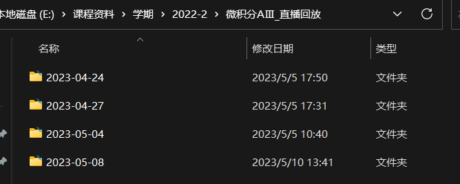
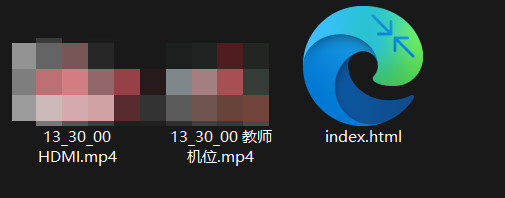
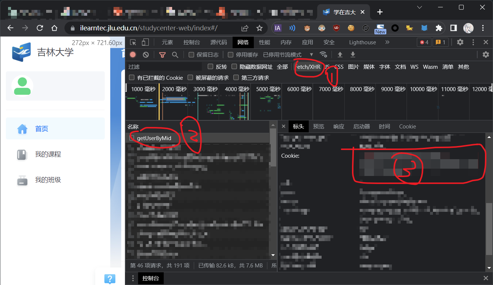
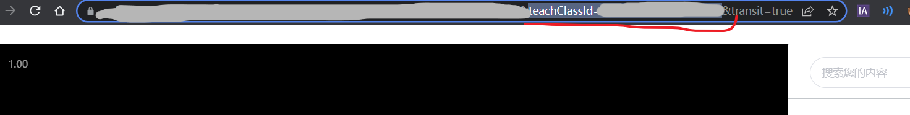
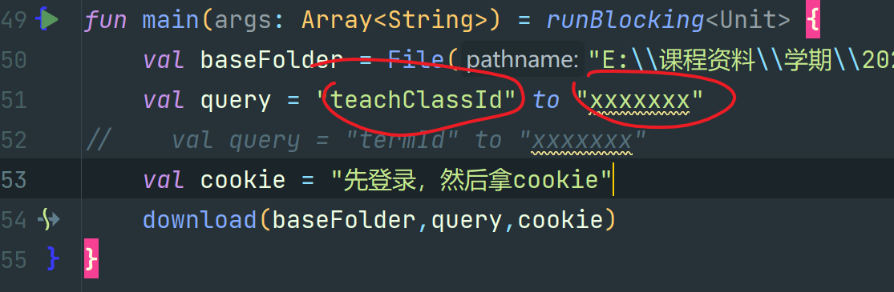
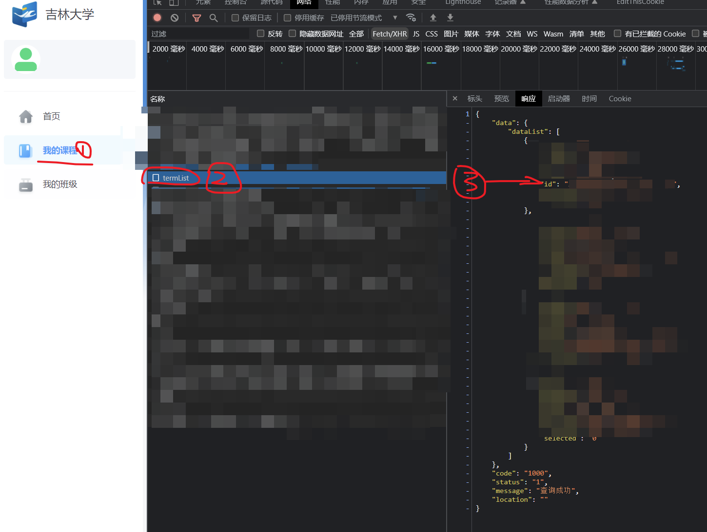
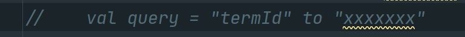

# 学在吉大视频下载器/H5播放器

~~写着玩的~~

## QwQ

## 功能

+ 视频下载(按课程，按学期)
+ 自动分类(保存文件夹/课程名/日期/视频类型.MP4)
+ 跳过已下载文件(~~没得写了，凑字数~~)
+ 播放器(同步播放，可拖动进度条)

## 使用

1. 按f12 打开你的浏览器
2. 登录学在吉大，然后等画面加载出来
3. 按以下步骤找到你的cookie
4. 将cookie复制到主函数
5. ⅰ如果你想下载某一科的视频，请先进入该课程的任意一个视频，然后在地址栏寻找类似下图的东西
6. 将他粘贴到query里面
7. ⅱ如果你想下载全部视频，请
8. 然后
9. 最后运行即可

## TODO（画大饼/pr is welcome）

- [ ] GUI客户端 (下辈子再说)
- [ ] 自动获取cookie(Selenium)
- [ ] 播放器增加速度控制
- [ ] 更好的播放器界面